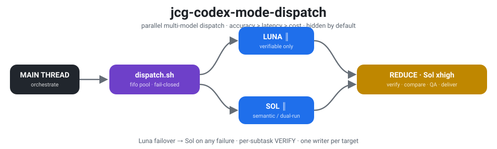
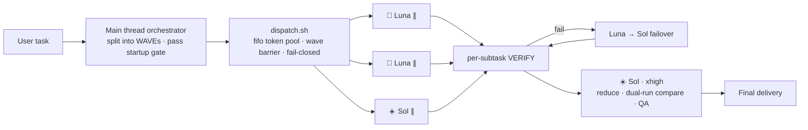

<p align="right">
  <strong>English</strong> · <a href="./README.zh-CN.md">简体中文</a>
</p>

<p align="center">
  
</p>

<p align="center">
  <sub>Codex CLI ≥ 0.146 · hidden by default · manual trigger · accuracy-first</sub>
</p>

<p align="center">
  <a href="https://opensource.org/licenses/MIT"></a>
  <a href="https://github.com/chenguang-jiang/jcg-codex-mode-dispatch">= 0.146"></a>
  
  
  
  <a href="https://github.com/chenguang-jiang/jcg-codex-mode-dispatch/actions/workflows/test.yml"></a>
</p>

# jcg-codex-mode-dispatch

`jcg-codex-mode-dispatch` is a Codex Skill that decomposes a **decomposable large task** into independent subtasks and runs them **in parallel as separate `codex exec` sub-processes**, routing each subtask to `gpt-5.6-luna` (fast/cheap — only for machine-verifiable output) or `gpt-5.6-sol` (strong — for everything else and final synthesis); `gpt-5.6-terra` is an optional middle tier. The main thread owns decomposition, routing, quality control, and final acceptance.

It is a **parallel dispatcher with a hard startup gate**, not a mandatory pipeline: small work stays in the main thread; only large work pays the parallelism cost.

> Priority, non-negotiable: **accuracy > latency > cost**.
> Technical route: shell-nested `codex exec -m` (not codex's native `spawn_agent`); `-m` pins the model explicitly and is **immune to the Sol / MultiAgent V2 routing regression**.

## How it works



## When to use / When NOT to

Every `codex exec` sub-process pays a **fixed ~35–45s startup tax** before any work begins (plugin load + model refresh + websocket prewarm + MCP retries, measured on this machine). Parallelism only pays off when there are enough independent subtasks.

| Scenario | Use this skill? | Why |
|---|---|---|
| Add tests / extract / rewrite across N (≥3) files in batch | ✅ yes | parallel gain > startup tax |
| Multi-source parallel research + synthesis (map-reduce) | ✅ yes | independent slices + one reduce |
| High-stakes work needing dual-run cross-validation | ✅ yes | parallelism buys accuracy |
| A single Q&A / one small edit | ❌ no | main thread answers instantly; exec wastes ~37s |
| Fewer than 3 subtasks | ❌ no | parallelism cannot amortize the tax |
| Tightly-coupled, strictly sequential work | ❌ no | cannot be parallelized |

**Pre-dispatch self-check (three questions)**: ① ≥ 3 subtasks and mutually independent? ② each > 60s and not instantly answerable by the main thread? ③ total parallel gain > startup tax + coordination cost? **Dispatch only if all three are yes**; any no → do it in the main thread. Even when the user names the skill, if the gate is not met the main thread first explains "not worth parallelizing" and then just does it.

## Model roles

- **Luna (🌙) · `gpt-5.6-luna` · effort ≥ medium · verifiable-only** — batch work whose result is machine-verifiable: schema-bound extraction, self-running unit tests after generation, lint/format fixes. No verification → no Luna.
- **Sol (☀️) · `gpt-5.6-sol` · effort high–xhigh** — semantic and unverifiable work (summarize / translate / rewrite / analyze), architecture / hard debug / cross-file refactor / security review, and the **final reduce + arbitration** (xhigh).
- **Terra (🪐) · `gpt-5.6-terra` · optional** — fill it by hand in `tasks.tsv` only when you want "cheaper than Sol, steadier than Luna"; the default routing does not use it.

Routing philosophy: bias toward Sol; only sink subtasks with a machine-check step down to Luna. Unsure → default Sol, or **dual-run**.

| Subtask type | Model | Effort floor | Redundancy |
|---|---|---|---|
| Machine-verifiable batch work | `gpt-5.6-luna` | medium (low only with strong checks) | Failover: Luna fails / check fails → auto Sol rerun |
| Semantic / unverifiable | `gpt-5.6-sol` | high | Dual-run for high stakes |
| Architecture / debug / refactor / security | `gpt-5.6-sol` | high–xhigh | Dual-run for high stakes |
| reduce / synthesis / arbitration | `gpt-5.6-sol` | xhigh | Per-item QA |

## Routing & execution rules

- **Startup gate first**: if the "When to use" conditions are not met, do not launch dispatch; do it in the main thread.
- **Fail-closed**: an empty or illegal `model` in `tasks.tsv` makes `dispatch.sh` abort with an error — **no silent fallback** to a default model. Wrong routing = wrong result; stop instead.
- **Dispatch contract (seven fields)**: each subtask brief is self-contained with `Outcome` / `Benefit` / `Sources` / `Scope` / `Checks` / `Stop when` / `Return`; missing key fields → no dispatch.
- **Per-subtask machine verification**: `Checks` go into the tsv `VERIFY_CMD` (use `$OUT` for the artifact path); a non-zero exec rc or verify rc counts as failure.
- **Failover vs dual-run**: failover is a serial safety net (Luna fails → Sol/high rerun, cheap, on by default); dual-run is parallel redundancy (two rows luna+sol for one subtask, compared at reduce, buys accuracy).
- **Fresh context**: a sub-agent has no parent context; every factual source must be listed in the brief; missing sources must not be fabricated.
- **Reviewer independence**: review subtasks use fresh context with no prior debate / author / suspected findings / desired verdict.
- **Partial verdict**: at `Stop when`, return a usable partial result immediately; never time out silently or fabricate to "finish".
- **Wave parallelism**: parallel within a wave, serial between waves (`WAVE` column); concurrency cap via a fifo token pool, **compatible with macOS bash 3.2** (no `wait -n`); per-task timeout auto-detects `gtimeout`/`timeout`, skipped if absent.
- **One writer**: one writer per shared artifact / working tree; write subtasks set column 8 to `workspace-write`.
- **Accept on real artifacts**: trust real diffs / verification output / dual-run comparison, not the sub-agent's self-report.

## Install

> Requires **Codex CLI ≥ 0.146**. On older versions `gpt-5.6-luna` / `gpt-5.6-terra` are rejected server-side ("requires a newer version of Codex"); only Sol works and the binary routing cannot function. Upgrade with `codex update` or `brew upgrade --cask codex`.

Option 1: one-line install (when the repo follows the layout below)

```bash
npx skills add chenguang-jiang/jcg-codex-mode-dispatch
```

Option 2: manual install

```bash
git clone https://github.com/chenguang-jiang/jcg-codex-mode-dispatch.git
# symlink the skill dir into Codex's skills directory (personal scope)
ln -s "$PWD/jcg-codex-mode-dispatch/skills/jcg-codex-mode-dispatch" ~/.codex/skills/
# or copy instead
# cp -R jcg-codex-mode-dispatch/skills/jcg-codex-mode-dispatch ~/.codex/skills/
```

If it does not appear right away, open a new Codex task or restart Codex. Self-check with the test suites (both run in CI on every push):

```bash
python3 ~/.codex/skills/jcg-codex-mode-dispatch/tests/test_skill_contract.py   # 13 contract assertions
bash    ~/.codex/skills/jcg-codex-mode-dispatch/tests/test_dispatch.sh         # 6 dispatch behavior tests (no network)
```

## Use

The skill is **hidden by default** (`disable-model-invocation: true`); the model cannot see it normally and never auto-applies it. Trigger with:

```text
/skill:jcg-codex-mode-dispatch
```

or by naming it in the prompt:

```text
Use jcg-codex-mode-dispatch to handle in parallel: add self-running unit tests to
these 6 modules, one subtask per module, then synthesize a coverage report.
```

The main thread auto-checks the startup gate, decomposes, writes `tasks.tsv`, dispatches, and runs QA + synthesis. `tasks.tsv` column format:

```text
WAVE<TAB>MODEL<TAB>EFFORT<TAB>WORKDIR<TAB>OUTFILE<TAB>VERIFY_CMD<TAB>PROMPT[<TAB>SANDBOX]
```

For debugging, see each artifact's `*.log` / `*.err` and `<tsv>.failures`.

## Customize

- **Change routing / effort floors / priority**: edit the "Model roles" table and the frontmatter `metadata` in `SKILL.md`.
- **Change the allowed-model allowlist**: `ALLOWED_MODELS` at the top of `scripts/dispatch.sh` (the fail-closed source of truth; keep the SKILL.md routing table in sync).
- **Change concurrency**: `MAX_CONCURRENCY=N ./scripts/dispatch.sh ...` at runtime (default 4; lower on 429s).
- **Change per-task timeout**: the seconds in `twrap 600` inside `scripts/dispatch.sh`.
- **Change sub-agent behavioral constraints**: the injected `GUARD` text in `scripts/dispatch.sh` (appended rules that never change the task body).
- **Switches**: remove the frontmatter `disable-model-invocation: true` to let the model also auto-suggest (not recommended); rename the dir with a `.disabled` suffix to hard-disable (reversible); `codex --no-skills` disables all.

## Repository layout

```text
jcg-codex-mode-dispatch/
├── README.md                       # English (this file)
├── README.zh-CN.md                 # 简体中文
├── LICENSE                         # MIT
├── CHANGELOG.md                    # Keep a Changelog
├── .gitignore
├── assets/
│   └── readme/
│       └── banner.svg              # README banner (light/dark aware)
├── .github/
│   └── workflows/
│       └── test.yml                # CI: contract + dispatch behavior tests
└── skills/
    └── jcg-codex-mode-dispatch/    # Installable Skill
        ├── SKILL.md                # Orchestration: startup gate / routing / contract / discipline / switches
        ├── scripts/
        │   └── dispatch.sh         # Parallel dispatcher: waves / fifo token pool / verify / failover / fail-closed
        └── tests/
            ├── test_skill_contract.py  # 13 contract assertions (guard SKILL.md / README against drift)
            └── test_dispatch.sh        # 6 behavior tests via a fake `codex` stub (no network)
```

> The extra `skills/<name>/` layer at the repo root is kept for `npx skills add` compatibility.

## Design highlights (verified)

- **Startup gate**: the ~35–45s startup tax is encoded as a hard rule, so simple tasks are not mis-routed and slowed down.
- **Fifo token pool**: `read -n1 -u 9` enforces the concurrency cap and works on macOS's stock bash 3.2.
- **Fail-closed**: illegal / empty model → `exit 2`, preventing silent mis-routing.
- **GUARD injection**: appended as "additional rules", constraining sub-agents not to spawn descendants, not to read skill instructions, not to fabricate — without inducing idle compliance.
- **Failover + dual-run**: two accuracy-first safety nets absent from the native spawn route.
- **Two test suites**: 13 contract assertions lock down priority, routing table, the seven fields, the startup gate, the switches, and bilingual READMEs; 6 dispatch behavior tests (fail-closed, verify, failover, wave barrier, concurrency cap) run against a fake `codex` stub with no network.
- **End-to-end verified**: 3×Luna parallel + Sol reduce all pass verification, `exit 0`.

## License

[MIT](./LICENSE) © [chenguang-jiang](https://github.com/chenguang-jiang)
