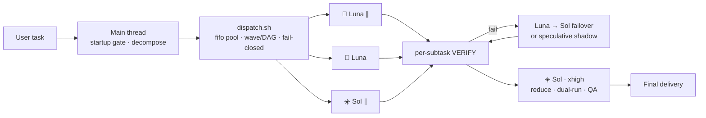

<p align="center">
  
</p>

<p align="center">
  <a href="./README.zh-CN.md">简体中文</a>
  ·
  <a href="https://opensource.org/licenses/MIT"></a>
  
  
  
  <a href="https://github.com/chenguang-jiang/jcg-codex-mode-dispatch/actions/workflows/test.yml"></a>
</p>

> **Priority, non-negotiable: accuracy > latency > cost.**
> Hidden by default (`disable-model-invocation: true`). Trigger with `/skill:jcg-codex-mode-dispatch`.

---

## Proof

| Suite | Tests | What it guards |
|---|---|---|
| Contract (`test_skill_contract.py`) | 14 | Priority order, routing table, dispatch contract, startup gate, GUARD, perf optimizations, bilingual README, repo assets |
| Behavior (`test_dispatch.sh`) | 8 | Fail-closed abort, parallel verify, verify-failure collection, Luna→Sol failover, wave barrier, concurrency cap, DAG deps, speculative failover |
| End-to-end (real Codex CLI 0.146) | 1 | 3×Luna parallel + Sol reduce, all checks pass, `exit 0` |

All 22 tests run in CI on every push via [GitHub Actions](.github/workflows/test.yml). Behavior tests use a fake `codex` stub — **zero network, zero cost**.

## What it is

`jcg-codex-mode-dispatch` is a Codex Skill that decomposes a large task into independent subtasks and runs them **in parallel as separate `codex exec` sub-processes**, routing each to:

- **Luna** (`gpt-5.6-luna`) — fast/cheap, **only** for machine-verifiable output
- **Sol** (`gpt-5.6-sol`) — strong, for everything else + final synthesis
- **Terra** (`gpt-5.6-terra`) — optional middle tier

Technical route: shell-nested `codex exec -m` (not native `spawn_agent`); `-m` pins the model explicitly and is **immune to the Sol / MultiAgent V2 routing regression**.

## How it works



## When to use / When NOT to

Every `codex exec` pays a **fixed ~35–45s startup tax** (measured). Parallelism only pays off with enough independent subtasks.

| Scenario | Use? | Why |
|---|---|---|
| Batch add tests / extract / rewrite across ≥3 files | ✅ | parallel gain > startup tax |
| Multi-source research + synthesis (map-reduce) | ✅ | independent slices + one reduce |
| High-stakes work needing dual-run cross-validation | ✅ | parallelism buys accuracy |
| Single Q&A / one small edit | ❌ | main thread answers instantly |
| Fewer than 3 subtasks | ❌ | cannot amortize the tax |
| Tightly-coupled sequential work | ❌ | cannot parallelize |

**Pre-dispatch self-check**: ① ≥3 independent subtasks? ② each >60s? ③ parallel gain > tax + coordination? **All yes → dispatch; any no → main thread.**

## Model roles

| Subtask type | Model | Effort floor | Redundancy |
|---|---|---|---|
| Machine-verifiable batch | `gpt-5.6-luna` | medium | Failover → Sol on failure |
| Semantic / unverifiable | `gpt-5.6-sol` | high | Dual-run for high stakes |
| Architecture / debug / refactor / security | `gpt-5.6-sol` | high–xhigh | Dual-run for high stakes |
| Reduce / synthesis / arbitration | `gpt-5.6-sol` | xhigh | Per-item QA |

**Routing philosophy**: bias toward Sol; only sink subtasks with a machine-check step to Luna. Unsure → Sol or dual-run.

## Execution rules

- **Fail-closed**: empty/illegal model → `exit 2`, no silent fallback.
- **Dispatch contract** (seven fields): `Outcome` / `Benefit` / `Sources` / `Scope` / `Checks` / `Stop when` / `Return`.
- **Per-subtask VERIFY**: `VERIFY_CMD` in tsv uses `$OUT`; non-zero rc = failure.
- **Failover**: Luna fails → Sol/high rerun (serial safety net, on by default). `SPECULATIVE_FAILOVER=1` launches a delayed Sol shadow in parallel — if Luna fails, the shadow is already running.
- **DAG deps** (column 9 `DEPENDS_ON`): tasks with declared file deps bypass the wave barrier and start as soon as deps appear.
- **Batch exec**: 2–4 light subtasks (<15s each) merge into one `codex exec` call, paying the startup tax once.
- **Dual-run**: two rows (luna+sol) for one subtask, compared at reduce (parallel redundancy).
- **Fresh context**: no parent context; missing sources must not be fabricated.
- **Reviewer independence**: no prior debate / author / desired verdict.
- **Partial verdict**: return usable partial result at `Stop when`; never fabricate to "finish".
- **Wave parallelism**: parallel within wave, serial between; fifo token pool (bash 3.2 compatible).
- **One writer**: one writer per shared artifact; write tasks set column 8 to `workspace-write`.

## Install

> Requires **Codex CLI ≥ 0.146**. Older versions reject Luna/Terra server-side.

```bash
# one-line
npx skills add chenguang-jiang/jcg-codex-mode-dispatch

# or manual
git clone https://github.com/chenguang-jiang/jcg-codex-mode-dispatch.git
ln -s "$PWD/jcg-codex-mode-dispatch/skills/jcg-codex-mode-dispatch" ~/.codex/skills/
```

Self-check:

```bash
python3 ~/.codex/skills/jcg-codex-mode-dispatch/tests/test_skill_contract.py
bash    ~/.codex/skills/jcg-codex-mode-dispatch/tests/test_dispatch.sh
```

## Use

```text
/skill:jcg-codex-mode-dispatch
```

or name it in the prompt:

```text
Use jcg-codex-mode-dispatch to handle in parallel: add self-running unit tests to
these 6 modules, one subtask per module, then synthesize a coverage report.
```

`tasks.tsv` columns:

```text
WAVE<TAB>MODEL<TAB>EFFORT<TAB>WORKDIR<TAB>OUTFILE<TAB>VERIFY_CMD<TAB>PROMPT[<TAB>SANDBOX[<TAB>DEPENDS_ON]]
```

Debug: `*.log` / `*.err` per artifact, `<tsv>.failures` for the run.

## Customize

| What | Where |
|---|---|
| Routing / effort / priority | `SKILL.md` model-roles table + frontmatter `metadata` |
| Allowed-model allowlist | `ALLOWED_MODELS` in `scripts/dispatch.sh` |
| Concurrency | `MAX_CONCURRENCY=N` at runtime (default 4) |
| Speculative failover | `SPECULATIVE_FAILOVER=1` + `SPECULATIVE_DELAY=N` (default 30s) |
| Skip plugin loading | `EXTRA_EXEC_FLAGS="--ignore-user-config --ignore-rules"` (experimental) |
| Per-task timeout | `twrap 600` seconds in `scripts/dispatch.sh` |
| Sub-agent GUARD | `GUARD` text in `scripts/dispatch.sh` |
| Auto-suggest (not recommended) | remove `disable-model-invocation: true` from frontmatter |
| Hard-disable (reversible) | rename dir with `.disabled` suffix |

## Repository layout

```text
jcg-codex-mode-dispatch/
├── README.md / README.zh-CN.md
├── LICENSE · CHANGELOG.md · .gitignore
├── assets/readme/hero.svg
├── .github/workflows/test.yml
└── skills/jcg-codex-mode-dispatch/
    ├── SKILL.md
    ├── scripts/dispatch.sh
    └── tests/
        ├── test_skill_contract.py   (14 assertions)
        └── test_dispatch.sh         (8 behavior tests)
```

## License

[MIT](./LICENSE) © [chenguang-jiang](https://github.com/chenguang-jiang)
