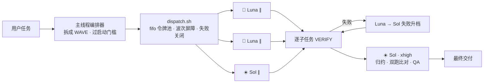

<p align="right">
  <a href="./README.md">English</a> · <strong>简体中文</strong>
</p>

<p align="center">
  
</p>

<p align="center">
  <sub>Codex CLI ≥ 0.146 · 默认隐藏 · 手动触发 · 准确性优先</sub>
</p>

<p align="center">
  <a href="https://opensource.org/licenses/MIT"></a>
  <a href="https://github.com/chenguang-jiang/jcg-codex-mode-dispatch">= 0.146"></a>
  
  
  
  <a href="https://github.com/chenguang-jiang/jcg-codex-mode-dispatch/actions/workflows/test.yml"></a>
</p>

# jcg-codex-mode-dispatch

`jcg-codex-mode-dispatch` 是一个 Codex Skill：把**可分解的大任务**拆成相互独立的子任务，以**多个独立的 `codex exec` 子进程并行执行**，并把每个子任务路由到 `gpt-5.6-luna`（快/省——仅用于输出可机器验证的活）或 `gpt-5.6-sol`（强——其余一切与最终综合）；`gpt-5.6-terra` 是可选的中间档。主线程负责拆解、路由、质量控制与最终验收。

它是一个**带硬性启动门槛的并行派发器**，不是强制流水线：小活留在主线程，只有大活才付出并行成本。

> 优先级，不可妥协：**准确性 > 时延 > 成本**。
> 技术路线：shell 嵌套 `codex exec -m`（而非 codex 原生 `spawn_agent`）；`-m` 显式钉死模型，**不受 Sol / MultiAgent V2 路由回退问题影响**。

## 工作原理



## 何时用 / 何时不用

每个 `codex exec` 子进程在开始干活前都要付一笔**固定的 ~35–45s 启动税**（插件加载 + 模型刷新 + websocket 预热 + MCP 重试，本机实测）。只有独立子任务足够多时，并行才划算。

| 场景 | 用本 skill？ | 原因 |
|---|---|---|
| 批量给 N（≥3）个文件加测试 / 抽取 / 重写 | ✅ 用 | 并行收益 > 启动税 |
| 多源并行调研 + 综合（map-reduce） | ✅ 用 | 独立切片 + 一次归约 |
| 需要双跑交叉验证的高风险活 | ✅ 用 | 用并行买准确性 |
| 单个问答 / 一处小改 | ❌ 不用 | 主线程秒答；exec 白烧 ~37s |
| 子任务少于 3 个 | ❌ 不用 | 并行摊不平启动税 |
| 强耦合、严格串行的活 | ❌ 不用 | 无法并行 |

**派发前自检（三问）**：① 子任务 ≥ 3 且两两独立？② 每个 > 60s 且主线程无法秒答？③ 总并行收益 > 启动税 + 协调成本？**三问全 yes 才派发**；任一 no → 主线程直接做。即使用户点名要用本 skill，若不过门槛，主线程先说明"不值得并行"，然后直接做。

## 模型角色

- **Luna（🌙）· `gpt-5.6-luna` · effort ≥ medium · 仅可验证** —— 结果可机器验证的批量活：按 schema 抽取、生成后能自跑的单测、lint/format 修复。没有验证手段 → 不用 Luna。
- **Sol（☀️）· `gpt-5.6-sol` · effort high–xhigh** —— 语义/不可验证的活（总结/翻译/重写/分析）、架构/疑难调试/跨文件重构/安全审查，以及**最终归约 + 仲裁**（xhigh）。
- **Terra（🪐）· `gpt-5.6-terra` · 可选** —— 仅当你想要"比 Sol 省、比 Luna 稳"时手动填进 `tasks.tsv`；默认路由不用它。

路由哲学：偏向 Sol；只把带机器校验环节的活下沉给 Luna。拿不准 → 默认 Sol，或**双跑**。

| 子任务类型 | 模型 | effort 地板 | 冗余 |
|---|---|---|---|
| 可机器验证的批量活 | `gpt-5.6-luna` | medium（仅强校验时才 low） | 失败升档：Luna 失败/校验失败 → 自动 Sol 重跑 |
| 语义 / 不可验证 | `gpt-5.6-sol` | high | 高风险双跑 |
| 架构 / 调试 / 重构 / 安全 | `gpt-5.6-sol` | high–xhigh | 高风险双跑 |
| 归约 / 综合 / 仲裁 | `gpt-5.6-sol` | xhigh | 逐项 QA |

## 路由与执行规则

- **先过启动门槛**：不满足"何时用"的条件就不启动派发，主线程直接做。
- **失败关闭（fail-closed）**：`tasks.tsv` 里 `model` 为空或非法，`dispatch.sh` 直接报错中止——**绝不静默回退**到默认模型。路由错 = 结果错；宁可停。
- **派发契约（七字段）**：每个子任务简报自包含 `Outcome` / `Benefit` / `Sources` / `Scope` / `Checks` / `Stop when` / `Return`；缺关键字段 → 不派发。
- **逐子任务机器验证**：`Checks` 写进 tsv 的 `VERIFY_CMD`（用 `$OUT` 指代产物路径）；exec rc 或 verify rc 非零都算失败。
- **失败升档 vs 双跑**：失败升档是串行安全网（Luna 失败 → Sol/high 重跑，便宜，默认开）；双跑是并行冗余（一个子任务两行 luna+sol，归约时比对，用成本买准确）。
- **全新上下文**：子代理没有父上下文；一切事实来源必须列进简报；缺来源不得编造。
- **Reviewer 独立性**：评审子任务用全新上下文，不带先前争论/作者/疑似发现/期望结论。
- **partial verdict**：到 `Stop when` 立即返回可用的部分结果；绝不静默超时或为"完成"而编造。
- **波次并行**：波次内并行、波次间串行（`WAVE` 列）；fifo 令牌池限并发，**兼容 macOS bash 3.2**（不用 `wait -n`）；逐任务超时自动探测 `gtimeout`/`timeout`，缺失则跳过。
- **单写者**：每个共享产物/工作树只允许一个写者；写类子任务第 8 列填 `workspace-write`。
- **认真产物验收**：信真实 diff / 验证输出 / 双跑比对，不信子代理的自我汇报。

## 安装

> 需要 **Codex CLI ≥ 0.146**。旧版本上 `gpt-5.6-luna` / `gpt-5.6-terra` 会被服务端拒绝（"requires a newer version of Codex"）；只有 Sol 能用，二元路由无法工作。用 `codex update` 或 `brew upgrade --cask codex` 升级。

方式一：一行安装（仓库遵循下方布局时）

```bash
npx skills add chenguang-jiang/jcg-codex-mode-dispatch
```

方式二：手动安装

```bash
git clone https://github.com/chenguang-jiang/jcg-codex-mode-dispatch.git
# 把 skill 目录软链进 Codex 的 skills 目录（个人作用域）
ln -s "$PWD/jcg-codex-mode-dispatch/skills/jcg-codex-mode-dispatch" ~/.codex/skills/
# 或者用拷贝
# cp -R jcg-codex-mode-dispatch/skills/jcg-codex-mode-dispatch ~/.codex/skills/
```

若没有立刻出现，新开一个 Codex 任务或重启 Codex。用测试套件自检（两者都在 CI 上每次 push 自动跑）：

```bash
python3 ~/.codex/skills/jcg-codex-mode-dispatch/tests/test_skill_contract.py   # 13 项契约断言
bash    ~/.codex/skills/jcg-codex-mode-dispatch/tests/test_dispatch.sh         # 6 个派发行为测试（无网络）
```

## 使用

本 skill **默认隐藏**（`disable-model-invocation: true`）；模型平时看不到它，绝不会自动套用。触发方式：

```text
/skill:jcg-codex-mode-dispatch
```

或在 prompt 里点名：

```text
用 jcg-codex-mode-dispatch 并行处理：给这 6 个模块各加能自跑的单测，
一个模块一个子任务，然后综合出一份覆盖率报告。
```

主线程会自动过启动门槛、拆解、写 `tasks.tsv`、派发，并做 QA + 综合。`tasks.tsv` 列格式：

```text
WAVE<TAB>MODEL<TAB>EFFORT<TAB>WORKDIR<TAB>OUTFILE<TAB>VERIFY_CMD<TAB>PROMPT[<TAB>SANDBOX]
```

调试时看各产物的 `*.log` / `*.err` 与 `<tsv>.failures`。

## 自定义

- **改路由 / effort 地板 / 优先级**：编辑 `SKILL.md` 的"模型角色"表与 frontmatter `metadata`。
- **改允许模型白名单**：`scripts/dispatch.sh` 顶部的 `ALLOWED_MODELS`（失败关闭的唯一事实源；记得同步 SKILL.md 路由表）。
- **改并发**：运行时 `MAX_CONCURRENCY=N ./scripts/dispatch.sh ...`（默认 4；遇 429 调低）。
- **改逐任务超时**：`scripts/dispatch.sh` 里 `twrap 600` 的秒数。
- **改子代理行为约束**：`scripts/dispatch.sh` 里注入的 `GUARD` 文本（追加规则，绝不改动任务主体）。
- **开关**：删掉 frontmatter 的 `disable-model-invocation: true` 可让模型也能自动建议（不推荐）；给目录加 `.disabled` 后缀可硬禁用（可逆）；`codex --no-skills` 禁用全部。

## 仓库结构

```text
jcg-codex-mode-dispatch/
├── README.md                       # English
├── README.zh-CN.md                 # 简体中文（本文件）
├── LICENSE                         # MIT
├── CHANGELOG.md                    # Keep a Changelog
├── .gitignore
├── assets/
│   └── readme/
│       └── banner.svg              # README 横幅（适配明暗主题）
├── .github/
│   └── workflows/
│       └── test.yml                # CI：契约 + 派发行为测试
└── skills/
    └── jcg-codex-mode-dispatch/    # 可安装的 Skill
        ├── SKILL.md                # 编排：启动门槛 / 路由 / 契约 / 纪律 / 开关
        ├── scripts/
        │   └── dispatch.sh         # 并行派发器：波次 / fifo 令牌池 / 验证 / 失败升档 / 失败关闭
        └── tests/
            ├── test_skill_contract.py  # 13 项契约断言（防 SKILL.md / README 漂移）
            └── test_dispatch.sh        # 6 个行为测试，用假 `codex` 桩（无网络）
```

> 仓库根部多出的 `skills/<name>/` 一层是为兼容 `npx skills add`。

## 设计亮点（已验证）

- **启动门槛**：把 ~35–45s 启动税写成硬规则，简单任务不会被误路由、被拖慢。
- **fifo 令牌池**：`read -n1 -u 9` 限并发，在 macOS 自带 bash 3.2 上可用。
- **失败关闭**：非法/空模型 → `exit 2`，杜绝静默误路由。
- **GUARD 注入**：以"追加规则"形式注入，约束子代理不派生子代理、不读 skill 说明、不编造——同时不诱发"空转式服从"。
- **失败升档 + 双跑**：原生 spawn 路线所没有的两张准确性优先安全网。
- **两套测试**：13 项契约断言锁定优先级、路由表、七字段、启动门槛、开关、双语 README；6 个派发行为测试（失败关闭、验证、失败升档、波次屏障、并发上限）对假 `codex` 桩运行，无网络。
- **端到端验证**：3×Luna 并行 + Sol 归约全部通过验证，`exit 0`。

## 许可证

[MIT](./LICENSE) © [chenguang-jiang](https://github.com/chenguang-jiang)
