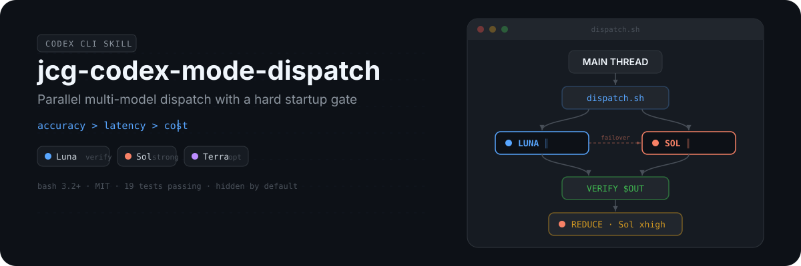
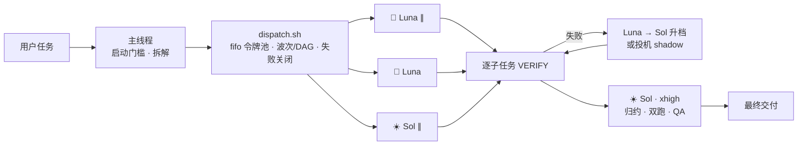

<p align="center">
  
</p>

<p align="center">
  <a href="./README.md">English</a>
  ·
  <a href="https://opensource.org/licenses/MIT"></a>
  
  
  
  <a href="https://github.com/chenguang-jiang/jcg-codex-mode-dispatch/actions/workflows/test.yml"></a>
</p>

> **优先级，不可妥协：准确性 > 时延 > 成本。**
> 默认隐藏（`disable-model-invocation: true`）。用 `/skill:jcg-codex-mode-dispatch` 触发。

---

## 验证

| 套件 | 测试数 | 守护内容 |
|---|---|---|
| 契约 (`test_skill_contract.py`) | 14 | 优先级、路由表、派发契约、启动门槛、GUARD、性能优化、双语 README、仓库资产 |
| 行为 (`test_dispatch.sh`) | 8 | 失败关闭中止、并行验证、验证失败收集、Luna→Sol 升档、波次屏障、并发上限、DAG 依赖、投机 failover |
| 端到端 (真实 Codex CLI 0.146) | 1 | 3×Luna 并行 + Sol 归约，全部通过，`exit 0` |

全部 22 项测试在每次 push 时由 [GitHub Actions](.github/workflows/test.yml) 自动运行。行为测试使用假 `codex` 桩——**零网络、零费用**。

## 这是什么

`jcg-codex-mode-dispatch` 是一个 Codex Skill：把大任务拆成独立子任务，以**多个 `codex exec` 子进程并行执行**，路由到：

- **Luna**（`gpt-5.6-luna`）—— 快/省，**仅**用于输出可机器验证的活
- **Sol**（`gpt-5.6-sol`）—— 强，用于其余一切 + 最终综合
- **Terra**（`gpt-5.6-terra`）—— 可选中间档

技术路线：shell 嵌套 `codex exec -m`（非原生 `spawn_agent`）；`-m` 显式钉死模型，**不受 Sol / MultiAgent V2 路由回退问题影响**。

## 工作原理



## 何时用 / 何时不用

每个 `codex exec` 付一笔**固定 ~35–45s 启动税**（实测）。只有独立子任务足够多时并行才划算。

| 场景 | 用？ | 原因 |
|---|---|---|
| 批量给 ≥3 个文件加测试 / 抽取 / 重写 | ✅ | 并行收益 > 启动税 |
| 多源调研 + 综合（map-reduce） | ✅ | 独立切片 + 一次归约 |
| 需要双跑交叉验证的高风险活 | ✅ | 用并行买准确性 |
| 单个问答 / 一处小改 | ❌ | 主线程秒答 |
| 子任务 < 3 个 | ❌ | 摊不平启动税 |
| 强耦合串行活 | ❌ | 无法并行 |

**派发前自检**：① ≥3 独立子任务？② 每个 >60s？③ 并行收益 > 税 + 协调成本？**全 yes 才派发；任一 no → 主线程做。**

## 模型角色

| 子任务类型 | 模型 | effort 地板 | 冗余 |
|---|---|---|---|
| 可机器验证的批量活 | `gpt-5.6-luna` | medium | 失败升档 → Sol |
| 语义 / 不可验证 | `gpt-5.6-sol` | high | 高风险双跑 |
| 架构 / 调试 / 重构 / 安全 | `gpt-5.6-sol` | high–xhigh | 高风险双跑 |
| 归约 / 综合 / 仲裁 | `gpt-5.6-sol` | xhigh | 逐项 QA |

**路由哲学**：偏向 Sol；只把带机器校验环节的活下沉给 Luna。拿不准 → Sol 或双跑。

## 执行规则

- **失败关闭**：空/非法模型 → `exit 2`，绝不静默回退。
- **派发契约**（七字段）：`Outcome` / `Benefit` / `Sources` / `Scope` / `Checks` / `Stop when` / `Return`。
- **逐子任务验证**：tsv 的 `VERIFY_CMD` 用 `$OUT`；rc 非零 = 失败。
- **失败升档**：Luna 失败 → Sol/high 重跑（串行安全网，默认开）。`SPECULATIVE_FAILOVER=1` 可并行启动延迟 Sol shadow——Luna 失败时 shadow 已在跑。
- **DAG 依赖**（第 9 列 `DEPENDS_ON`）：声明了文件依赖的任务绕过波次屏障，依赖一出现就启动。
- **轻任务合并**：2–4 个轻子任务（各 <15s）合并成一个 `codex exec` 调用，只付一次启动税。
- **双跑**：一个子任务两行 luna+sol，归约时比对（并行冗余）。
- **全新上下文**：无父上下文；缺来源不得编造。
- **Reviewer 独立性**：不带先前争论/作者/期望结论。
- **partial verdict**：到 `Stop when` 立即返回可用部分结果；绝不为"完成"而编造。
- **波次并行**：波内并行、波间串行；fifo 令牌池（兼容 bash 3.2）。
- **单写者**：每个共享产物只一个写者；写类子任务第 8 列填 `workspace-write`。

## 安装

> 需要 **Codex CLI ≥ 0.146**。旧版本服务端拒绝 Luna/Terra。

```bash
# 一行安装
npx skills add chenguang-jiang/jcg-codex-mode-dispatch

# 或手动
git clone https://github.com/chenguang-jiang/jcg-codex-mode-dispatch.git
ln -s "$PWD/jcg-codex-mode-dispatch/skills/jcg-codex-mode-dispatch" ~/.codex/skills/
```

自检：

```bash
python3 ~/.codex/skills/jcg-codex-mode-dispatch/tests/test_skill_contract.py
bash    ~/.codex/skills/jcg-codex-mode-dispatch/tests/test_dispatch.sh
```

## 使用

```text
/skill:jcg-codex-mode-dispatch
```

或在 prompt 里点名：

```text
用 jcg-codex-mode-dispatch 并行处理：给这 6 个模块各加能自跑的单测，
一个模块一个子任务，然后综合出一份覆盖率报告。
```

`tasks.tsv` 列格式：

```text
WAVE<TAB>MODEL<TAB>EFFORT<TAB>WORKDIR<TAB>OUTFILE<TAB>VERIFY_CMD<TAB>PROMPT[<TAB>SANDBOX[<TAB>DEPENDS_ON]]
```

调试：各产物 `*.log` / `*.err`，运行级 `<tsv>.failures`。

## 自定义

| 改什么 | 在哪改 |
|---|---|
| 路由 / effort / 优先级 | `SKILL.md` 模型角色表 + frontmatter `metadata` |
| 允许模型白名单 | `scripts/dispatch.sh` 的 `ALLOWED_MODELS` |
| 并发数 | 运行时 `MAX_CONCURRENCY=N`（默认 4） |
| 投机 failover | `SPECULATIVE_FAILOVER=1` + `SPECULATIVE_DELAY=N`（默认 30s） |
| 跳过插件加载 | `EXTRA_EXEC_FLAGS="--ignore-user-config --ignore-rules"`（实验性） |
| 逐任务超时 | `scripts/dispatch.sh` 里 `twrap 600` 的秒数 |
| 子代理 GUARD | `scripts/dispatch.sh` 里的 `GUARD` 文本 |
| 自动建议（不推荐） | 删 frontmatter 的 `disable-model-invocation: true` |
| 硬禁用（可逆） | 目录名加 `.disabled` 后缀 |

## 仓库结构

```text
jcg-codex-mode-dispatch/
├── README.md / README.zh-CN.md
├── LICENSE · CHANGELOG.md · .gitignore
├── assets/readme/hero.svg
├── .github/workflows/test.yml
└── skills/jcg-codex-mode-dispatch/
    ├── SKILL.md
    ├── scripts/dispatch.sh
    └── tests/
        ├── test_skill_contract.py   (14 项断言)
        └── test_dispatch.sh         (8 个行为测试)
```

## 许可证

[MIT](./LICENSE) © [chenguang-jiang](https://github.com/chenguang-jiang)
